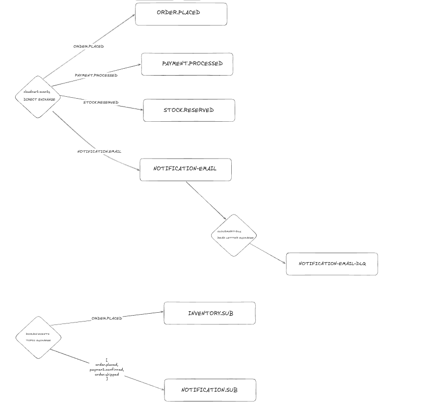

<p align="center">


</p>

# CloudMart E-commerce

CloudMart is a learning project focused on microservices architecture in .NET, built to explore Clean Architecture, Domain-Driven Design, CQRS, asynchronous messaging, distributed observability, and modern software engineering practices in an e-commerce ecosystem.

> This is a learning project under active development. Today, the **Identity Service** is the only microservice with implemented .NET code. The remaining services (Catalog, Notifications, etc.) already have infrastructure provisioned via Docker Compose, but are still under construction.

---

## Table of Contents

- [Architecture](#architecture)
- [Microservices](#microservices)
    - [Identity Service](#identity-service)
    - [Catalog Service (under construction)](#catalog-service-under-construction)
- [Infrastructure and Observability](#infrastructure-and-observability)
- [Database](#database)
- [Messaging](#messaging)
- [Prerequisites](#prerequisites)
- [Installation and Running the Project](#installation-and-running-the-project)
    - [Linux](#linux)
    - [macOS](#macos)
    - [Windows](#windows)
- [Environment Variables](#environment-variables)
- [Testing](#testing)
- [CI/CD](#cicd)
- [Repository Structure](#repository-structure)
- [Common Issues](#common-issues)

---

## Architecture

CloudMart follows a decoupled **microservices** architecture, communicating asynchronously through message brokering (RabbitMQ) and exposing independent HTTP APIs. Each service owns its own database (Database per Service pattern), avoiding direct coupling between domains.

Within each microservice, the code organization follows **Clean Architecture** combined with **Vertical Slice Architecture**:

```
{Service}.API/              → HTTP endpoints (Carter), inbound contracts (Request DTOs)
{Service}.Application/      → Commands, Queries, Handlers (CQRS via MediatR), validation, outbound contracts
{Service}.Domain/           → Entities, Value Objects, business invariants — no external dependencies
{Service}.Infrastructure/   → EF Core, repositories, concrete providers (database, storage, etc.)
```

The dependency rule between layers always points toward the domain core:

```
API  →  Application  →  Domain
Infrastructure  →  Application + Domain
```

`Domain` never depends on `Infrastructure` or `API` — it is pure, with no reference whatsoever to ASP.NET Core, Entity Framework, or any infrastructure-related third-party library. This is enforced even at the physical project level, not just by convention.

### Patterns Applied

- **DDD (Domain-Driven Design):** Aggregates, Value Objects, business invariants encapsulated within the entities themselves
- **CQRS:** separation between Commands (write) and Queries (read) via MediatR
- **Outbox Pattern:** ensures consistency between local persistence and asynchronous event publishing, avoiding the "dual write" problem in distributed systems
- **Repository + Unit of Work:** persistence abstraction decoupled from EF Core at the domain/application layer
- **Result Pattern:** business error handling without using exceptions for control flow

A shared library (**BuildingBlocks**) centralizes common abstractions across all microservices — `IRepository<T, TId>`, `IUnitOfWork`, `IAggregateRoot`, `IDomainEvent`, `ValueObject`, `OutboxMessage`, `Result<T>`, `ICurrentUser`, among others — avoiding infrastructure code duplication between services.

---

## Microservices

### Identity Service

Responsible for authentication, user management, roles, and refresh tokens. It is the most mature microservice in the project at the moment.

| Layer | Technologies |
|---|---|
| API | ASP.NET Core 9 (Minimal APIs), [Carter](https://github.com/CarterCommunity/Carter) for modular endpoint organization, [Scalar](https://github.com/scalar/scalar) for interactive API documentation |
| Application | [MediatR](https://github.com/jbogard/MediatR) (CQRS), [FluentValidation](https://github.com/FluentValidation/FluentValidation), [ErrorOr](https://github.com/amantinband/error-or) / custom `Result<T>`, [Mapster](https://github.com/MapsterMapper/Mapster) for object-to-object mapping |
| Domain | Entities (`User`, `Role`, `RefreshToken`), Value Objects (`Email`, `Password`, `CompleteName`) with encapsulated business invariants |
| Infrastructure | [Entity Framework Core 9](https://learn.microsoft.com/ef/core/) with [Npgsql](https://www.npgsql.org/) (PostgreSQL), [BCrypt.Net](https://github.com/BcryptNet/bcrypt.net) for password hashing |
| Observability | [Serilog](https://serilog.net/) (structured logging) with a Grafana Loki sink, [OpenTelemetry](https://opentelemetry.io/) for distributed tracing |
| Resilience | [Polly](https://github.com/App-vNext/Polly) for retry policies on infrastructure calls |

**Implemented features:**
- User registration with domain validation (`Email`, `Password`, `CompleteName`)
- Password hashing via BCrypt — never stored as plain text
- Role model (Admin, Customer)
- Refresh Token structure for authenticated sessions
- Outbox Pattern for future domain event publishing (e.g., `UserRegisteredEvent`)

### Catalog Service (under construction)

Catalog's infrastructure is already provisioned via Docker Compose (dedicated PostgreSQL, schema and role configuration via `init.sql`), but the .NET service code is still under development. The planned domain covers:

- `Product` (Aggregate Root) with a `Money` Value Object for pricing
- `ProductImage` as part of the Product Aggregate
- `Category` as an independent Aggregate
- `Review` as an independent Aggregate (separated from `Product` to avoid write contention in high-volume review scenarios)

---

## Infrastructure and Observability

The entire development environment runs via Docker Compose, organized into reusable layers:

```
docker/
  base/                  → base definitions for infrastructure and application services
  config/                → external configuration files (Postgres, RabbitMQ, Loki, Tempo, Grafana)
  environments/          → environment-specific compositions (development, production)
  observability/         → observability stack (Prometheus, Grafana, Loki, Tempo)
  overrides/             → environment-specific adjustments (exposed ports, resources, etc.)
```

The observability stack integrates:

| Tool | Role |
|---|---|
| [Prometheus](https://prometheus.io/) | Metrics collection |
| [Grafana](https://grafana.com/) | Dashboards and unified visualization (metrics, logs, and traces) |
| [Loki](https://grafana.com/oss/loki/) | Structured log aggregation |
| [Tempo](https://grafana.com/oss/tempo/) | Distributed tracing, correlated with logs and metrics |

Logs, metrics, and traces are correlated with each other in Grafana via `TraceId`/`SpanId`, allowing navigation from an error log directly to the full trace of the request that originated it.

---

## Database

The RDBMS used is **PostgreSQL**, following the *Database per Service* pattern — each microservice owns its own database, schema, and dedicated access roles (application role with minimal permissions, read-only role for analytical queries).

[ "Database ER Diagram"

---

## Messaging

Asynchronous communication between microservices uses **RabbitMQ** as the default message broker, with the **Outbox Pattern** ensuring that event publishing is never lost in case of failure between local persistence and message delivery.

[](docs/assets/cloudmart_rabbitmq_architecture.png)

---

## Prerequisites

Before running the project, make sure your machine has:

| Requirement | Version | Why |
|---|---|---|
| [.NET SDK](https://dotnet.microsoft.com/download/dotnet/9.0) | **9.0.118** or higher (rollForward: latestMajor) | Runtime and SDK to build and run the microservices. The exact version is pinned in [`global.json`](global.json) |
| [Docker](https://www.docker.com/) + Docker Compose | Latest stable | Orchestrates the entire infrastructure: PostgreSQL, RabbitMQ, Redis, Azurite, and the observability stack |
| [Git](https://git-scm.com/) | Latest stable | To clone the repository |
| `make` *(optional, recommended)* | — | Shortcuts for Docker Compose commands via [`makefile`](makefile). Already available by default on Linux and macOS; see instructions below for Windows |

> The project pins the .NET SDK version via `global.json` with `rollForward: latestMajor` — meaning any installed 9.x SDK is accepted, but it must be **at least** version `9.0.118`.

---

## Installation and Running the Project

The clone and `.env` setup steps are the same across all three operating systems — the difference lies in installing the prerequisites.

### Linux

**1. Install .NET SDK 9**

```bash
# Ubuntu/Debian
wget https://packages.microsoft.com/config/ubuntu/24.04/packages-microsoft-prod.deb -O packages-microsoft-prod.deb
sudo dpkg -i packages-microsoft-prod.deb
sudo apt update
sudo apt install -y dotnet-sdk-9.0

# Confirm the version
dotnet --version
```

**2. Install Docker and Docker Compose**

```bash
curl -fsSL https://get.docker.com -o get-docker.sh
sudo sh get-docker.sh

# Add your user to the docker group (avoids needing sudo for every command)
sudo usermod -aG docker $USER
newgrp docker
```

`make` is already installed on most distributions. If not:

```bash
sudo apt install -y make
```

**3. Clone the repository**

```bash
git clone https://github.com/miguelpombodev/cloudmart-ecommerce.git
cd cloudmart-ecommerce
```

**4. Set up environment variables**

```bash
cp .env.example .env.development
# Edit .env.development with the required values — see the Environment Variables section below
```

**5. Spin up the infrastructure**

```bash
make infra
```

**6. Run the Identity Service**

```bash
cd src/Services/Identity/Identity.API
dotnet run
```

The API will be available at `http://localhost:5000` (or whichever port is configured in `launchSettings.json`), with interactive Scalar documentation available at `/scalar`.

---

### macOS

**1. Install .NET SDK 9**

Via [Homebrew](https://brew.sh/):

```bash
brew install --cask dotnet-sdk

dotnet --version
```

Or download the installer directly from [dotnet.microsoft.com/download](https://dotnet.microsoft.com/download/dotnet/9.0).

**2. Install Docker Desktop**

```bash
brew install --cask docker
```

Open Docker Desktop at least once to finish setup and ensure the daemon is running.

`make` already comes pre-installed on macOS (via Xcode Command Line Tools). If needed:

```bash
xcode-select --install
```

**3 to 6. Same steps as Linux**

```bash
git clone https://github.com/miguelpombodev/cloudmart-ecommerce.git
cd cloudmart-ecommerce

cp .env.example .env.development
# edit .env.development

make infra

cd src/Services/Identity/Identity.API
dotnet run
```

---

### Windows

**1. Install .NET SDK 9**

Download the installer from [dotnet.microsoft.com/download](https://dotnet.microsoft.com/download/dotnet/9.0), or via [winget](https://learn.microsoft.com/windows/package-manager/winget/):

```powershell
winget install Microsoft.DotNet.SDK.9

dotnet --version
```

**2. Install Docker Desktop**

Download from [docker.com/products/docker-desktop](https://www.docker.com/products/docker-desktop/) or via winget:

```powershell
winget install Docker.DockerDesktop
```

> Docker Desktop on Windows requires **WSL 2** (Windows Subsystem for Linux). If you don't have it yet, install it with:
> ```powershell
> wsl --install
> ```
> Restart your machine after installing WSL 2 before opening Docker Desktop for the first time.

**3. Install `make`**

Windows doesn't ship with `make` natively. The simplest options:

```powershell
# Via winget
winget install GnuWin32.Make

# Or via Chocolatey, if already installed
choco install make
```

Alternatively, run the Docker Compose commands directly without `make` (see note below).

**4. Clone the repository**

It's recommended to run the following steps via **PowerShell** or, ideally, inside **WSL 2** (integrated Linux terminal), since the rest of the ecosystem (scripts, Makefile) is designed for a Unix-like environment.

```powershell
git clone https://github.com/miguelpombodev/cloudmart-ecommerce.git
cd cloudmart-ecommerce
```

**5. Set up environment variables**

```powershell
copy .env.example .env.development
# edit .env.development with a text editor
```

**6. Spin up the infrastructure**

With `make` installed:

```powershell
make infra
```

Without `make`, run the equivalent commands directly:

```powershell
docker network create cloudmart_net
docker compose -f docker/environments/development.infra.yml up -d
```

**7. Run the Identity Service**

```powershell
cd src/Services/Identity/Identity.API
dotnet run
```

---

## Environment Variables

The [`.env.example`](.env.example) file documents every variable needed to run the infrastructure. Copy it to `.env.development` (or `.env.production`) and fill in the values before spinning up the containers.

```env
ASPNETCORE_ENVIRONMENT=
REDIS_PASSWORD=
RABBITMQ_USER=
RABBITMQ_PASSWORD=
CATALOG_DB_PASSWORD=
SMTP_HOST=
SMTP_PORT=
SMTP_USER=
SMTP_PASSWORD=
SMTP_FROM_EMAIL=
SMTP_FROM_NAME=
EMAIL_QUEUE_NAME=
EMAIL_EXCHANGE_NAME=
EMAIL_ROUTING_KEY=
GRAFANA_USER=
GRAFANA_PASSWORD=
```

| Variable | Description | Example |
|---|---|---|
| `ASPNETCORE_ENVIRONMENT` | ASP.NET Core execution environment. Controls detailed logging, exposed Swagger/Scalar, and exception behavior | `Development` |
| `REDIS_PASSWORD` | Redis authentication password, used for distributed caching | any strong password |
| `RABBITMQ_USER` | RabbitMQ administrator user (management dashboard + service authentication) | `admin` |
| `RABBITMQ_PASSWORD` | Password for the user above | any strong password |
| `CATALOG_DB_PASSWORD` | Password for the Catalog Service's application role in PostgreSQL | any strong password |
| `SMTP_HOST` | SMTP server host used by the email notification service | `sandbox.smtp.mailtrap.io` (dev) |
| `SMTP_PORT` | SMTP server port | `465` |
| `SMTP_USER` | SMTP authentication user | provided by the provider (e.g., Mailtrap) |
| `SMTP_PASSWORD` | SMTP authentication password | provided by the provider |
| `SMTP_FROM_EMAIL` | Sender email address for platform notifications | `no-reply@cloudmart.com` |
| `SMTP_FROM_NAME` | Sender display name | `Cloudmart Shop` |
| `EMAIL_QUEUE_NAME` | RabbitMQ queue name consumed by the email sender service | `sub-email-sender` |
| `EMAIL_EXCHANGE_NAME` | RabbitMQ exchange name bound to the email queue | `sub-email-sender-exchange` |
| `EMAIL_ROUTING_KEY` | Routing key used in the binding between the exchange and the email queue | `sub-email` |
| `GRAFANA_USER` | Grafana administrator user | `admin` |
| `GRAFANA_PASSWORD` | Password for the Grafana administrator user | any strong password |

> **Never commit a filled-in `.env.development` or `.env.production` file** — only the empty `.env.example` template should be version-controlled in Git.

---

## Testing

The project follows the testing pyramid, with coverage at different levels of granularity using **xUnit**:

| Layer | Technology | What it validates |
|---|---|---|
| Unit | xUnit + [FluentAssertions](https://fluentassertions.com/) + [Moq](https://github.com/devlooped/moq) | Domain logic (Value Objects, entity invariants) and Handler orchestration, isolated from real infrastructure |
| Integration | xUnit + [Testcontainers](https://testcontainers.com/) | Repositories against a real, ephemeral PostgreSQL instance, validating EF Core configurations, Owned Types, and database constraints |
| E2E | xUnit + `WebApplicationFactory` | Full HTTP contract of the endpoints — status codes, serialization, headers — spinning up the entire API in memory |

### Running tests locally

```bash
dotnet test src/Cloudmart.slnx --configuration Release
```

### Running with a coverage report

```bash
dotnet test src/Cloudmart.slnx \
  --configuration Debug \
  --logger "trx;LogFileName=results.trx" \
  --collect:"XPlat Code Coverage" \
  --results-directory ./coverage

dotnet tool install -g dotnet-reportgenerator-globaltool

reportgenerator \
  -reports:"./coverage/**/coverage.cobertura.xml" \
  -targetdir:"./coverage/merged" \
  -reporttypes:Html

# Open ./coverage/merged/index.html in your browser to inspect line-by-line coverage
```

> Integration tests using Testcontainers require **Docker to be running** on your machine, since they spin up a real, ephemeral PostgreSQL container during the test run.

---

## CI/CD

The Pull Request pipeline, defined in [`.github/workflows`](.github/workflows), runs automatically on every PR opened against `main` or `develop`:

| Step | Tool | Purpose |
|---|---|---|
| Build & Test | `dotnet build` / `dotnet test` | Ensures the code compiles and all tests pass |
| Code Coverage | Coverlet + ReportGenerator + `irongut/CodeCoverageSummary` | Generates a coverage report and publishes a summary as a PR comment |
| Test Report | `dorny/test-reporter` | Publishes test results (passed/failed) as a GitHub Check Run |
| Secret Scanning | [TruffleHog](https://github.com/trufflesecurity/trufflehog) | Scans the entire PR history for accidentally exposed credentials |

### Branch Protection

The `main` and `develop` branches are protected via GitHub Rulesets:

- Pull Request required before merging
- Status checks (CI) must pass before merging
- Force push and branch deletion blocked
- Linear history required (squash/rebase only)

### Commit Convention

The repository follows [Conventional Commits](https://www.conventionalcommits.org/), validated where applicable via Commitlint:

```
<type>(<scope>): <short description in lowercase>

[optional body explaining the why]
```

Types used: `feat`, `fix`, `docs`, `refactor`, `test`, `chore`, `perf`, `ci`.

### Dependabot

Dependency updates (NuGet, GitHub Actions, Docker) are monitored automatically via [`.github/dependabot.yml`](.github/dependabot.yml), with patch updates grouped together and Pull Requests opened weekly for review.

---

## Repository Structure

```
cloudmart-ecommerce/
├── .github/                         → CI/CD workflows, Dependabot, PR templates
├── docker/
│   ├── base/                        → Base infrastructure and service definitions
│   ├── config/                      → External configuration files (Postgres init.sql, RabbitMQ, Loki, Tempo, Grafana)
│   ├── environments/                → Environment-specific compositions (development, production, development.infra)
│   ├── observability/               → Observability stack (Prometheus, Grafana, Loki, Tempo)
│   └── overrides/                   → Environment-specific adjustments
├── docs/
│   └── assets/                      → Diagrams (ER, RabbitMQ architecture)
├── src/
│   ├── BuildingBlocks/              → Shared abstractions library across microservices
│   ├── Services/
│   │   ├── Identity/
│   │   │   ├── Identity.API/
│   │   │   ├── Identity.Application/
│   │   │   ├── Identity.Domain/
│   │   │   ├── Identity.Infrastructure/
│   │   │   └── Identity.Tests/
│   │   └── Catalog/                 → Infrastructure provisioned; .NET code under construction
│   └── Cloudmart.slnx                → Main solution
├── .env.example                     → Template of required environment variables
├── global.json                      → Pinned .NET SDK version used in the project
├── makefile                         → Shortcuts for Docker Compose commands
└── README.md
```

---

## Common Issues ⚠️

A collection of problems you're likely to run into when setting up or contributing to the project, and how to resolve them.

### `network cloudmart_net declared as external, but could not be found`

Docker Compose expects the `cloudmart_net` network to already exist before any service starts, since it's shared across multiple compose files. Create it manually before running `make infra` for the first time:

```bash
docker network create cloudmart_net
```

If you're using `make`, this is already handled automatically by the `network` target in the `makefile` — make sure you're running `make infra` and not calling `docker compose` directly without first creating the network.

### `dotnet run` fails trying to build a service that has no Dockerfile yet

If you run `make dev` (instead of `make infra`) before the application services have a working Dockerfile, Docker Compose will try to build an image from source and fail with something like `unable to prepare context: path "..." not found`. Until a service has a working Dockerfile, only bring up the infrastructure layer:

```bash
make infra
```

Then run the .NET service locally via `dotnet run`, pointing to the infrastructure already running in Docker.

### `Unable to resolve service for type 'IUserRepository'` (or similar DI errors)

This means an interface was defined but its concrete implementation was never registered in the DI container. Double-check that **both** `AddApplicationServices()` and `AddInfrastructureServices()` are being called in `Program.cs`, and that the repository/provider in question is registered inside `AddInfrastructureServices()`.

### `relation "identity.users" does not exist` when running integration tests

This usually means EF Core migrations were never generated for the entity in question, or the schema name configured via `.ToTable("users", "identity")` doesn't match what the migration actually created. Confirm migrations exist with:

```bash
dotnet ef migrations list \
  --project src/Services/Identity/Identity.Infrastructure \
  --startup-project src/Services/Identity/Identity.API
```

If the list is empty, generate the initial migration before running integration tests again.

### `DbUpdateException` with no clear cause when running integration tests

This is almost always a **Foreign Key violation** hiding behind a generic exception — most commonly a `User` being persisted with a `Role` that was created in memory but never actually saved to the test database. Make sure any referenced entity (like `Role`) is seeded into the test database **before** building the aggregate that references it.

### Coverage file (`coverage.cobertura.xml`) is not generated, or ends up empty

This is a known instability when combining `dotnet test` against a `.sln`/`.slnx` file with Coverlet's `/p:CollectCoverage=true` MSBuild properties — the property sometimes fails to propagate to the actual test project. Prefer the `--collect:"XPlat Code Coverage"` collector instead, and merge the (GUID-named) output folders afterward with `reportgenerator`:

```bash
dotnet tool install -g dotnet-reportgenerator-globaltool

reportgenerator \
  -reports:"./coverage/**/coverage.cobertura.xml" \
  -targetdir:"./coverage/merged" \
  -reporttypes:Cobertura
```

Also make sure tests are built in `Debug` configuration when collecting coverage — `Release` builds can strip the symbol information Coverlet needs to map coverage accurately.

### GitHub Actions fails with `Resource not accessible by integration` when posting a PR comment

The default `GITHUB_TOKEN` has read-only permissions by default on newer repositories. Add explicit permissions to the workflow:

```yaml
permissions:
  contents: read
  pull-requests: write
  checks: write
```

If the error persists, also check **Settings → Actions → General → Workflow permissions** and make sure "Read and write permissions" is enabled at the repository level.

### Serilog throws a `NullReferenceException` related to Loki on startup

This happens when the `Loki:Url` configuration key is missing or empty, usually because the API is being run locally (outside Docker) while `appsettings.json` still points to the `loki` hostname (only resolvable inside the Docker network). When running the API locally, use `http://localhost:3100` instead of `http://loki:3100` in `appsettings.Development.json`.

### `MSB1008: Only one project can be specified`

This happens when `dotnet build`/`dotnet test` is pointed at a folder (e.g. `src`) that contains multiple `.csproj`/`.sln` files instead of pointing directly at the solution file. Always target the solution explicitly:

```bash
dotnet test src/Cloudmart.slnx
```

---

## License

Distributed under the MIT License. See [`LICENSE`](LICENSE) for more details.
